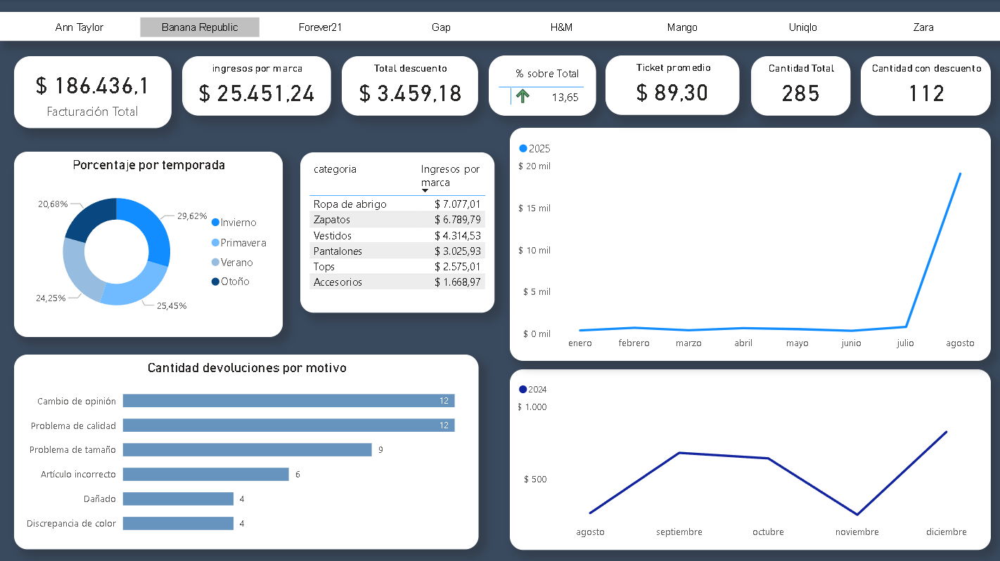
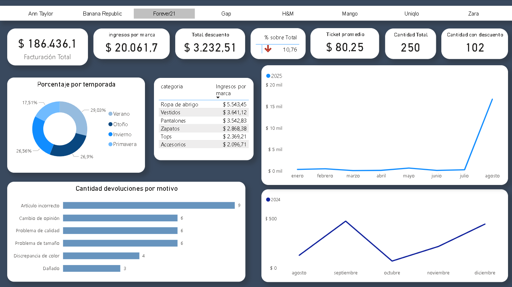
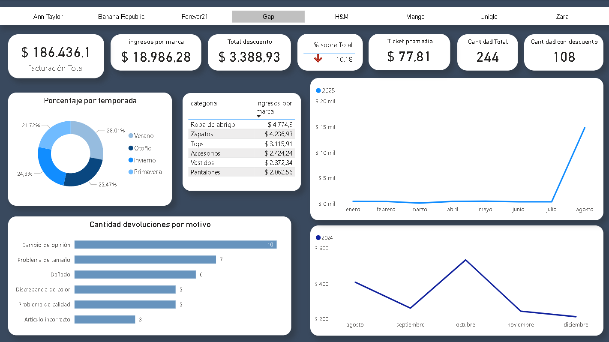
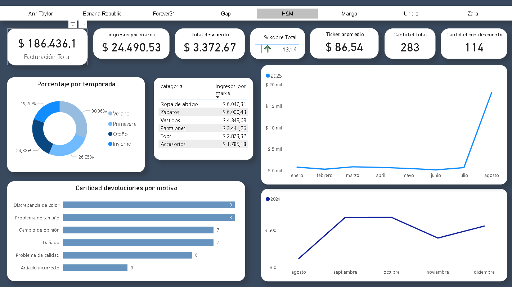
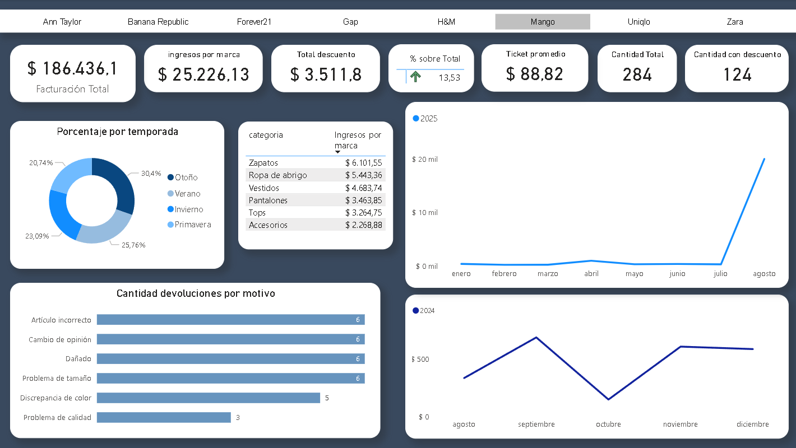
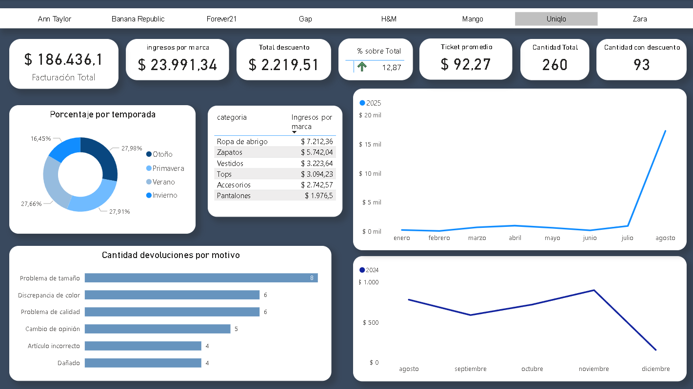
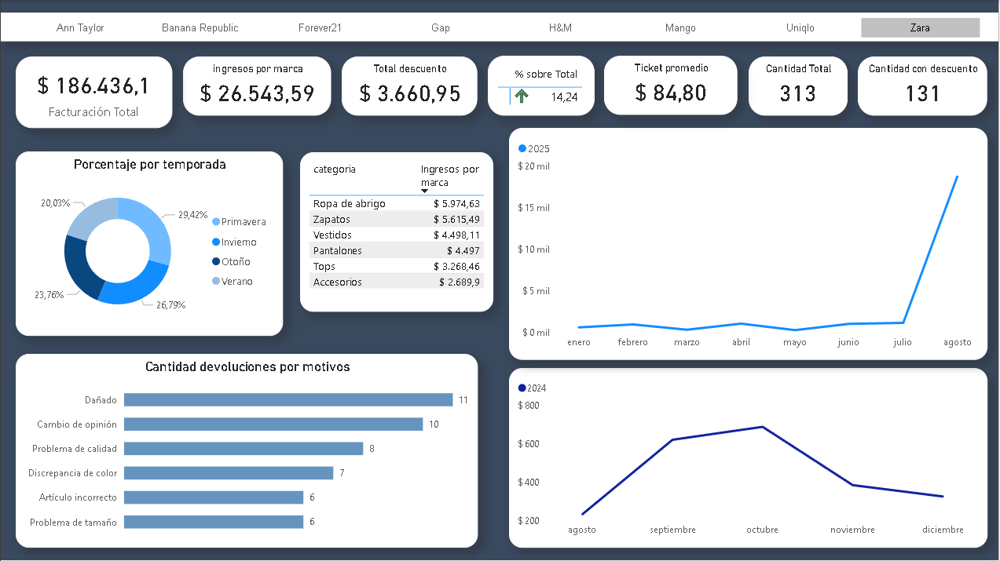

# Retail-Sales-Analyist

Este proyecto analiza el rendimiento de ventas de una boutique de ropa de lujo minorista.  El objetivo es evaluar el comportamiento de los ingresos por cada marca, el impacto de los descuentos, los patrones estacionales y las tendencias de compra de los clientes para extraer información comercial.

---

## Proyecto simulación de un retail con Dashboard interactivo
Este conjunto de datos es una simulación que representa ventas minoristas.

---

## Objetivo del proyecto

- Analizar los ingresos totales y la distribución de ventas por marca.
- Evaluar el impacto de los descuentos en los ingresos generales.
- Identificar las categorías con mejor desempeño por temporada.
- Medir el ticket promedio por marca y categoría.
- Analizar los retornos por motivo.
- Comparar la evolución de las ventas anuales.

---

## Campos del dataset

- `producto_id`
- `categoria`
- `marca`
- `temporada` (Verano, Invierno, etc)
- `talla`
- `color`
- `precio_original`
- `porcentaje_descuento`
- `precio_actual`
- `fecha_compra`
- `cantidad_stock`
- `calificacion_cliente`
- `devolucion` (Si, No)
- `motivo_devolucion`

---

## KPIs claves

- Ingresos totales
- Ticket promedio
- Unidades vendidas
- Ingresos por marca (con % por sobre el total)
- Ingresos por categoría
- % Descuentos sobre las ventas
- Devoluciones con motivo
- Comportamiento de las ventas por estación

---

## Herramientas utilizadas

- Power BI (visualización de datos)
- SQLite (consultas exploratorias)
- Power Query (transformación de datos)
- Kaggle (dataset)

---

## Principales insights

- Los descuentos representan aproximadamente el 40% de las ventas en algunas marcas.
- Durante la temporada de verano, la categoria de invierno mostró mayores ventas.
- El ticket promedio de algunas marcas se matuvo estable en comparación con el ticket promedio total.
- Las devoluciones muestran motivos variados, pero se destaca el problema de tamaño y la calidad. 

---

## Dashboard interactivo
A continuación se muestran capturas con las distintas marcas, para que se pueda ver el comportamiento del ticket promedio y el valor porcentual de las mismas sobre el total. Se utilizo un segmentador para selecconar cada marca, si lo desea, puede consultar el dashboard mediante el archivo `.pbix` subido al repositorio.

## Datos relevantes

- Las ventas de las marcas Ann Taylor y Uniqlo dependieron aproximadamente el 36% de los descuentos, en las demás superaba el 39%. Sin embargo Ann Taylor no logró una participación significativa dentro del total facturado.
- Gap fue la marca que menos valor porcentual obtuvo sobre el total. Además su ticket promedio no se mantuvo estable al ticket promedio del total.
- Aunque Unqlo no alcanzó los niveles de facturación de Zara, Mango y Banana Republic, fue la marca con el ticket promedio más alto.
- Durante el año 2024 las ventas se concentraron entre septiempre y octubre, con algunos picos altos en noviembre. En 2025, agosto fue el mes con mayor facturación. Una observación destacable es la categoría ropa de abrigo fue la que más ingresos generó entre las temporadas de primavera y verano, lo que indicaria una estrategia de liquidación por el fin de temporada.

